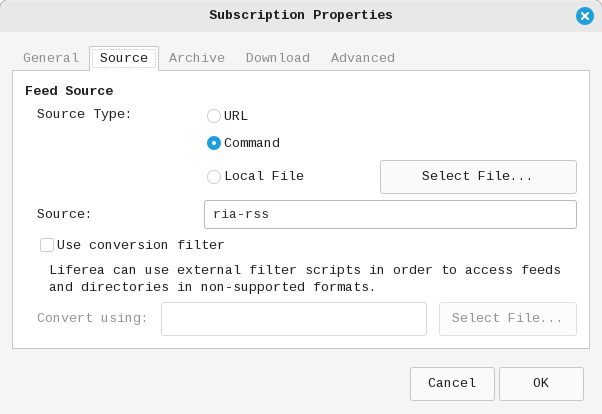

# ria-rss: фильтр для добавления текста новостей к RSS от РИА Новости.

[](https://opensource.org/licenses/BSD-3-Clause)

Программа предназначена для использования в качестве внешнего фильтра для RSS от РИА Новости.
При вызове она считывает RSS feed со своего STDIN и выводит его на STDOUT в формате RSS XML v2.0
с добавлением текста новостей, что делает этот feed чуть более полезным. Обновление всего
списка новостей может занять некоторое время (примерно 15 секунд на моём компьютере).

Программа работает на платформе Linux. Протестировано на Linux Mint 22.0.

### Компиляция и установка
- Установить зависимости:
  ```bash
    sudo apt install lua5.3 libxml2-utils html-xml-utils
    ```
  (или эквивалент для конкретной платформы)
- Перейти в корень проекта и запустить `make`
- Скопировать файл программы `ria-rss` в любую директорию из `$PATH`
- Подключить программу к используемому RSS ридеру. Способ подключения зависит от ридера.
  Например, для `liferea` окно настроек выглядит так:
  
